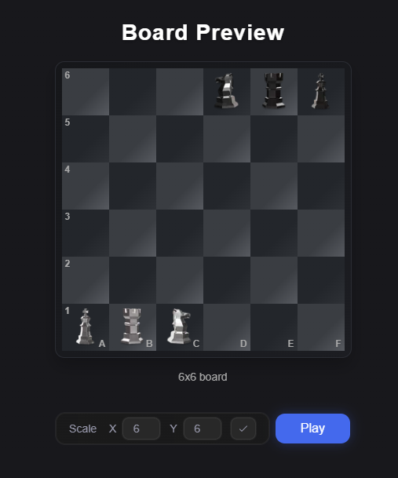
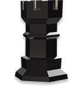
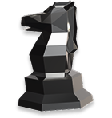
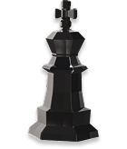

# next-chess-challenge

Welcome to next-chess-challenge! This is a strategy game with unique pieces, each with its own rules for movement and capture. Below, you will find a detailed explanation of how each piece works.

## 2 - The Pieces

The game features three distinct types of pieces: the "Developer," the "Designer," and the "Product Owner."

 

---

### The "Developer"

 

**Movement:**  
- Moves any number of squares **horizontally or vertically**, no diagonal moves.  
- Cannot jump over pieces when moving.

**Capture:**  
- Captures by jumping over an adjacent enemy piece to the empty square right beyond it (horizontally or vertically).  
- The jumped piece is removed.  
- The landing square must be empty. No jumping over multiple pieces or landing on occupied squares.
- 
---

### The "Designer"

 

**Movement:**
*   Can jump in an "L" shape, similar to the knight in chess (two squares in one direction and one perpendicularly, or one square in one direction and two perpendicularly).
*   As it's a jump, it ignores any pieces in its path.

**Capture:**
*   Captures other pieces by moving onto the square they occupy. The enemy piece is removed, and the Designer takes its place.

---

### The "Product Owner"

 

**Movement:**
*   Can move one square per turn.
*   Can move to any adjacent direction (vertical, horizontal, or diagonal).

**Capture:**
*   Captures other pieces by moving onto the square they occupy. The enemy piece is removed, and the Product Owner takes its place.

---

Have fun playing next-chess-challenge!
